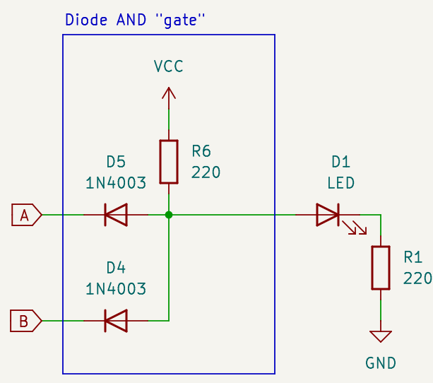

# Diodes & Diodes (Building AND gates the wrong way)

This video explores diode logic. Diode Logic is an approach that allows
building rudimentary "AND" gates and "OR" gates (but not "NOT" gates!). However they degrade the signal so they are not composable unless you re-amplify them.

Check the video first:

<iframe width="560" height="315" src="https://www.youtube.com/embed/lU2IVW7GjUQ?si=X5mdRarw_T9T74cO" title="YouTube video player" frameborder="0" allow="accelerometer; autoplay; clipboard-write; encrypted-media; gyroscope; picture-in-picture; web-share" referrerpolicy="strict-origin-when-cross-origin" allowfullscreen></iframe>

## Schematics

* [Download full schematic](schematic.png)
* [Download KiCAD schematic](/kicad/and-gates-p2/and-gates-p2.kicad_sch)

## What materials you need

If you want to rebuild this, check the video to see how many gates you want to build (the video starts with one, then goes to three), and adjust materials accordingly

* Input circuitry (pair of inputs):
  * 2 × push buttons.
  * 2 × 1KΩ resistor.
* Per gate (depending how many you want to build):
  * 2 × 220Ω resistor.
  * 2 × diode (see below)
* Output
  * 1 × LED. Any color will work; but if you built the composed three gates try both with a red and a blue one.
  * 1 × protection resistor for LED (330Ω is a reasonable amount, adjust according to preference)

### Which diode to use?

In the video, I used a 1N4003. They are extremely common and easy to find. Other diodes in the same family (anything in the range 1N4001 to 1N4007) are OK too. They worked for what I wanted to demonstrate, but
are not great diodes for digital logic; they are design to handle high voltages and power, rather than small signals that change quickly.

If you really want to use this as a gate (in a context where you can handle the signal loss) you may want to try something like a 1N4148. They are much faster in switching and can handle OK the small voltages in a logic circuit.

I've linked the data sheet to both models below

## Data sheets

* [1N4001-1N4007](https://www.vishay.com/docs/88503/1n4001.pdf) General Purpose Rectifier
* [1N4148](https://www.vishay.com/docs/81857/1n4148.pdf) Small Signal Fast Switching Diode.

