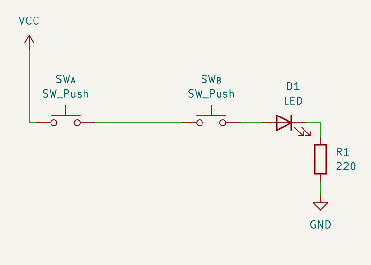
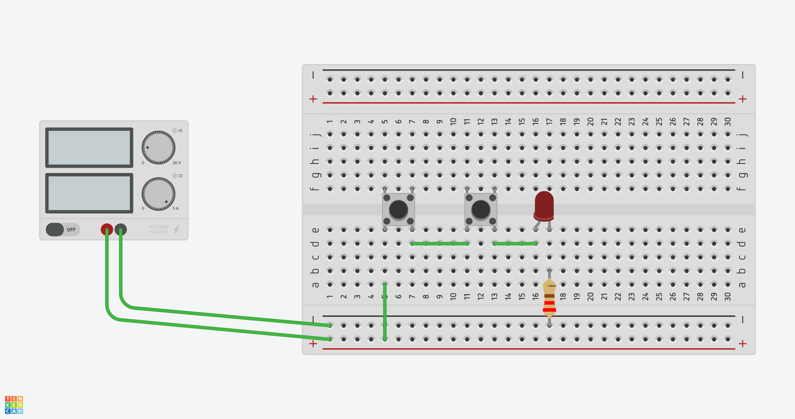

# Intro (Building AND gates the wrong way)

The circuit built in this video has as a goal mainly introducing the problem I want to
discuss. Check the video first:

<iframe width="560" height="315" src="https://www.youtube.com/embed/Vfc9OcyUivs?si=iac2tj8TG0BKNBkC" title="YouTube video player" frameborder="0" allow="accelerometer; autoplay; clipboard-write; encrypted-media; gyroscope; picture-in-picture; web-share" referrerpolicy="strict-origin-when-cross-origin" allowfullscreen></iframe>

It is a very simple build, and a good "first project to build on a breadboard". If you've
ever built anything more elaborate, probably you can skip this, and move on to 
[Part 2: Diodes&Diodes](/docs/and-gates-diodes).

Most of this document will be targeted at people very new to breadboarding.

## Schematics

* [Download full schematic](schematic.png)
* [Download KiCAD schematic](../../kicad/and-gates-p1/and-gates-p1.kicad_sch)

## What do you need

* 2 × push buttons. They should have pin spacing compatible with a breadboard. Some
  popular and widely available models have 5.08mm pin spacing in one dimension, and
  7.62mm in the other, those fit perfectly over the central groove in a breadboard.
* 1 × LED. Any color will work
* 1 × resistor. The value for the resistor should be at least 200Ω to avoid burning the
  LED; 220Ω is a typical value that will give you a *very* bright output. If you prefer
  a dimmer LED, you can try higher values and decide what you like (the higher the
  resistor value, the dimmer the LED will be).

## Breadboard Layout

